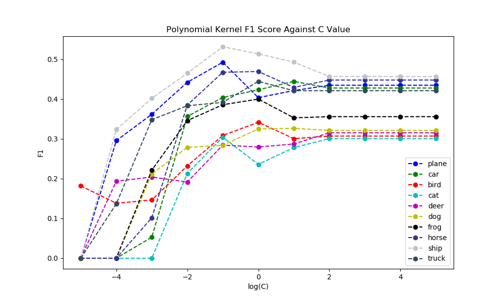
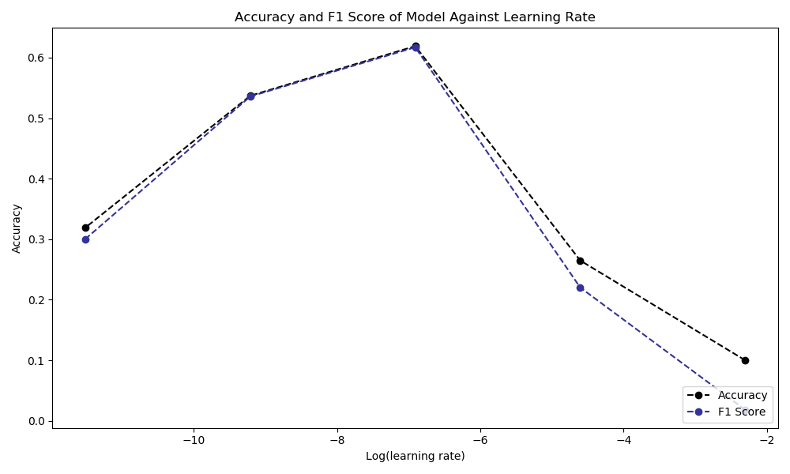

## Machine Learning Experiment

I used a data set of 4000 images for the training of the SVMs, and 60 000 images for the training of the CNNs. These appeared to be large enough to uncover the expected trends in the data whilst allowing for enough tests to be run in order to produce detailed graphs and allow for the comprehensive analysis of parameters.

### Part 1: SVM

#### Principle Component Analysis

    
    

The results indicate that there is a reduction in accuracy with a reduction in dimensionality after around 60% of the original dimensionality. We can therefore assume that approximately 40% of the data in the average image is redundant. The accuracy score resulting from test data is lower than that resulting from cross validation. This is to be expected as the model had not been trained on any of the test data, but had been trained on the validation data during previous iterations of CV. We can assume that the rise in accuracy resulting from the 10% decrease in dimensionality at 40% is due to noisy data, and therefore still fits the expected trend. The F1 scores are considerably more noisy than the accuracy because each category has been trained on one tenth of the total data. We can therefore expect that trends uncovered when looking at the overall accuracy would be considerably more distinguished than those produced from examining each class individually. For best results, we would apply a reduction in dimensionality of approximately 60% of the original dimensionality as we would increase the training time considerably whilst losing little relevant information.

#### Polynomial Kernel SVM:

The polynomial kernel was most accurate on the data with a C value of around 0 for kernels of degree two, three, and four. When using a C value smaller than 10, the decision boundary is not flexible enough to allow for the correct classification of as many images and the data is under-fit. The accuracy decreases after a C value of zero as the margin is not soft enough and the decision boundary is overfitted to the training data. The higher degree kernel overfits more than a lower degree because it is capable of drawing a more detailed decision boundary and adjusts to the details of the boundary in the training data to a greater extent.

    
    

The graph above shows accuracy results of a changing polynomial kernel degree. The curve peaks at a polynomial value of 2, after which the accuracy begins to drop. The SVM is likely not overfitting the dataset as the test accuracy and CV accuracy both decrease together, rather the kernel is making appropriate generalisations of the data from degree 1 to degree 2. The underlying equation for a polynomial kernel is $K(x,y) = (x^T y + c)^d$ therefore, with a degree of 0. The kernel function maps all data points to a value of 1 and is therefore no more accurate than the proportion of the dataset that this class represents (10%).

#### RBF Kernel SVM

    
    

The graph above shows that for a value of C < 0.01, the F1 scores for each class are unresponsively low. This is to be expected as the RBF kernels function will have a very soft margin and is resultantly misclassifying too many points in the training data. As the C is increased, the kernel will have a greater bias toward a decision boundary that correctly classifies more of the training data. The accuracy of the RBF Kernel begins drastically increasing in accuracy around a C value of 0.1, at this point, the boundaries drawn by the kernel function begin separating the different classes. This continues until a C value of approximately 1.0 is reached, where the accuracy reaches its maximum. It is likely that this is the maximum level of accuracy that can be achieved with this set of parameters for the RBF kernel, and that if we were to run tests with a larger value of C, the test accuracy would eventually begin to drop as the SVM began to overfit the data. The average F1 and accuracy scores do not vary by a considerable amount. This in part due to the even distribution of classes within the dataset.

    
    

As gamma is the multiplier that changes the size of the sphere of influence that each data point has on the decision plain, we would expect to see the accuracy peak at some value of gamma at the point in which the model is most balanced between being influenced by too many and too few data points. We can see that at a gamma value of 10$^{-2}$, the RBF kernel is influenced by data at the most optimal distance and the accuracy is at its peak for this set of parameters.

### Part 2: CNN

#### Full Connected Network

I decided to start the design of my model with an FCN and build up from there as a CNN should have at least one fully connected layer as its final layer. I created a class `FCN()` which takes as a parameter a number of hidden layers that the model should use. The class creates the number of hidden layers of size 3072 (3 * 32 * 32), and one output layer. As each of the hidden layers has 3072 channels, there is no information loss as this is the size of the data fed into the network (pixels x RGB). Initial research uncovered a model with only two linear layers [1]. The model consisted of numerous convolutional and max pooling layers, however the inout data was of a much higher dimensionality. Therefore I decided to use a range that both started lower and finished higher than the model used previously.

| Hidden Layers | Accuracy | F1 Score | Runtime |
| :-----------: | :------: | :------: | :-----: |
|       1       |  0.3675  |  0.3827  | 0:8:46  |
|       2       |  0.3989  |  0.3991  | 0:18:36 |
|       3       |  0.3945  |  0.3971  | 0:27:31 |

The table above shows that the accuracy of model increased from one to two hidden layers. This is because the complexity of the decision boundary increases with an extra layer and can categorise images more accurately. Adding a third layer to the model then decreases the accuracy. This is likely as a result of the graph running into the vanishing gradient problem whereby the weights of the earlier layers of the model are updated less as the gradient diminishes with the propagation through each layer.

As I will be adding convolutional layers and pooling kernels I do not require the fully connected layers of my graph to be able to produce the most optimal decision boundary by themselves. Therefore I believe 2 fully connected layers for my model should be enough to allow for sufficiently detailed decision boundaries.

#### Adding Convolution Layers

Most models online use convolutional layers in order to decrease training time and allow for greater parameter tuning. I decided to try my model with two, three and four layers of convolutions, all connected to two linear layers of fully connected nodes. After each convolutional layer, I apply a maxpooling layer with a size of 4 and a stride of 4.

| Model ID | Convolutional Layers | Accuracy | Average F1 Score | Runtime |
| :------: | :------------------: | :------: | :--------------: | ------- |
|  Conv1   |          1           |  0.3481  |      0.361       | 0:15:39 |
|  Conv2   |          2           |  0.4702  |      0.450       | 0:49:37 |
|  Conv3   |          3           |  0.4534  |      0.490       | 1:36:39 |

Based on the results from this test, I decided that my model should have 2 convolution layers as the results showed no improvement with a third layer. This is likely due to the nature of how higher level and lower level features are extracted with each layer.

#### Trialing Different Pooling Layers

I decided to trial an average pooling layer as well as max pooling. Average pooling layers are typically less effective as MaxPool because (at a high level) it is usually more 'useful' to the model to know the highest extent to which a feature is present in a region, rather than the average.

| Method  | Accuracy | F1 Score | Runtime |
| ------- | -------- | -------- | ------- |
| MaxPool | 0.4702   | 0.4502   | 0:49:37 |
| AvgPool | 0.3469   | 0.3293   | 0:43:40 |

#### Activation Functions

I decided to trial the following five functions because two of them (Sigmoid and Tanh) normalise the values output by the convolutional layers, and two of them (ReLU and softMax) do not. Therefore I should be able to see which of these two approaches my model is better suited to. In addition, I decided to test the ReLU6 method as Krizhevsky managed to achieve higher results than with standard ReLU on the same dataset [2].

| Activation Function | Accuracy | F1    | Runtime |
| ------------------- | -------- | ----- | ------- |
| None                | 0.4702   | 0.471 | 0:49:37 |
| ReLU                | 0.5863   | 0.583 | 0:44:24 |
| Sigmoid             | 0.1924   | 0.092 | 0:42:38 |
| SoftMax             | 0.1000   | 0.018 | 0:40:41 |
| Tanh                | 0.1000   | 0.018 | 0:40:51 |
| ReLU6               | 0.617    | 0.617 | 0:46:2  |

We can see that ReLU6 is performing the best just as in Krizhevsky's work. This is likely to be because it offers some normalisation in the form of an upper and lower bound of output, but does not affect a large proportion of values. I will therefore continue to build the model with this choice of activation function.

#### Channels

| Channels (conv1, conv2) | Accuracy Score | F1 Score | Runtime |
| :---------------------: | :------------: | :------: | :-----: |
|         (8,24)          |     0.615      |  0.612   | 0:44:24 |
|         (5, 15)         |     0.595      |  0.593   | 0:24:18 |
|         (6, 18)         |     0.619      |  0.607   | 0:29:14 |
|         (10,20)         |      0.63      |  0.633   | 0:33:20 |
|         (14,42)         |     0.628      |  0.629   | 1:31:22 |

Next I decided to trial varying the numbers of output channels of each convolutional layer. The most optimal number of layers trailed appears to be 10 for the first layer and 20 for the next. This is therefore the level where enough features are being extracted in each convolutional layer.

#### Epochs

The graph above shows the accuracy of the model on test data at each epoch. From epochs one to five, the model is fitting the data to an appropriate mount. After five epochs, the model begins to over fit the data. The test data remained the same throughout the training of this model and therefore was never trained on. Typically test data is not used to adjust parameters of the model and is instead used to evaluate the model at the end of development. However, I am not planning to productionised my model and am instead experimenting with different model architectures on the dataset. I am therefore allocating no data for a final test set to evaluate the model at the end of development in favour of having more data to train the model on during development. In this way, I am choosing to have a higher accuracy of the model at the cost of a lower accuracy of the evaluation of my model.

#### Learning Rate

As the learning rate is the amount by which we adjust weights with respect to the loss gradient, we would expect there to be some peak value. Too low and the weights will not converge fast enough for our finite dataset, too large and it may overshoot the optimal by a considerable amount. The optimal learning rate for this model is approximately 10$^{-7}$.

### Conclusion

My final model had an accuracy of 62% and an F1 score of 0.62. Given the limited time and processing power available for this project, my approach was to attempt to change all variables is series. If more time was available I would iterate this process of adjusting architecture and parameters in an attempt to focus in on the optimal combination. Furthermore, I would implement a heuristic such as a genetic algorithm that would search for the best parameters and architecture.

Whilst the CNN and SVM both had a similar maximum accuracy, a much smaller proportion of the search space of parameters was explored with CNN. I therefore hypothesise that given enough time, the CNN could achieve a large increase in accuracy, whilst the SVM only a marginal one. CNN is particularly effective at classifying images because it takes regional pixel values into consideration far more than SVM, which is concerned only with the dimensionality of the problem. Given a situation where it is expected that data will continue to be gathered after deployment, a CNN may also be preferable as it has the option to be further-trained on the new data (online/batch) without the requirement of being completely retrained on the original data as well.

### Works Cited

1. Haj-Hassan, Hawraa, et al. "Classifications of multispectral colorectal cancer tissues using convolution neural network." *Journal of pathology informatics* 8 (2017).
2. Alex Krizhevsky. "Convolutional Deep Belief Networks on CIFAR-10".